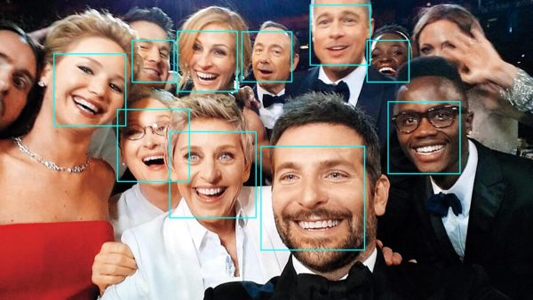

# Celebrity Facial Recognition

Este proyecto implementa un sistema de reconocimiento facial para identificar celebridades en imágenes y videos. Su objetivo es demostrar el potencial del reconocimiento facial, incluso con un conjunto de datos limitado y recursos computacionales accesibles.

<p align="center">
  
</p>  

## Características

- **Detección Facial**: Identifica rostros en imágenes y videos en tiempo real.
- **Reconocimiento de Celebridades**: Compara los rostros detectados con una base de datos preentrenada de celebridades.
- **Etiquetado de Resultados**: Muestra el nombre de la celebridad reconocida o marca el rostro como "Desconocido" si no se encuentra una coincidencia.
- **Visualización**: Dibuja rectángulos y etiquetas sobre los rostros detectados en las imágenes o videos procesados.

## Cómo Funciona

### 1. Entrenamiento del Modelo (`train_model.py`)
Antes de realizar el reconocimiento facial, es necesario entrenar el modelo con imágenes de celebridades:

1. Coloca las imágenes de entrenamiento en una carpeta estructurada con subdirectorios nombrados según la celebridad.
2. Ejecuta el script de entrenamiento:

   ```bash
   python train_model.py
   ```

   Esto generará un archivo `custom_encodings.pkl`, que contiene las codificaciones faciales de las celebridades.

### 2. Prueba con Imágenes Estáticas (`static_image_test.py`)
Para comprobar el modelo con una imagen específica:

1. Asegúrate de tener una imagen de prueba en la ruta adecuada.
2. Ejecuta:

   ```bash
   python static_image_test.py
   ```

   El resultado se mostrará en pantalla con los nombres de los rostros reconocidos.

### 3. Reconocimiento en Video (`recognition.py`)
Este script permite analizar un video en busca de celebridades reconocidas:

1. Ejecuta:

   ```bash
   python recognition.py
   ```

2. El sistema procesará el video cuadro a cuadro y mostrará los rostros detectados con etiquetas de identificación.

## Limitaciones y Posibles Mejoras

### **Limitaciones Actuales**
- **Rendimiento**: Puede optimizarse para procesar videos más rápidamente.
- **Ángulos y Accesorios**: La identificación de rostros en perfiles o con gafas es un desafío.
- **Base de Datos Reducida**: La precisión del reconocimiento depende del número y calidad de imágenes de entrenamiento.

### **Mejoras Futuras**
- **Aumento de Datos**: Entrenar con más imágenes y variaciones de cada celebridad.
- **Uso de Redes Neuronales**: Implementar modelos de aprendizaje profundo para mejorar la precisión.
- **Optimización del Código**: Reducir el consumo de recursos y mejorar la velocidad de procesamiento.

## Requisitos

- Python 3.x
- `face_recognition`
- `opencv-python`
- `matplotlib`
- `pickle`

Instala las dependencias con:

```bash
pip install face_recognition opencv-python matplotlib pickle
```

## Contribuciones

Las contribuciones son bienvenidas. Si deseas mejorar este proyecto, puedes hacer un fork y enviar un pull request con tus mejoras.
